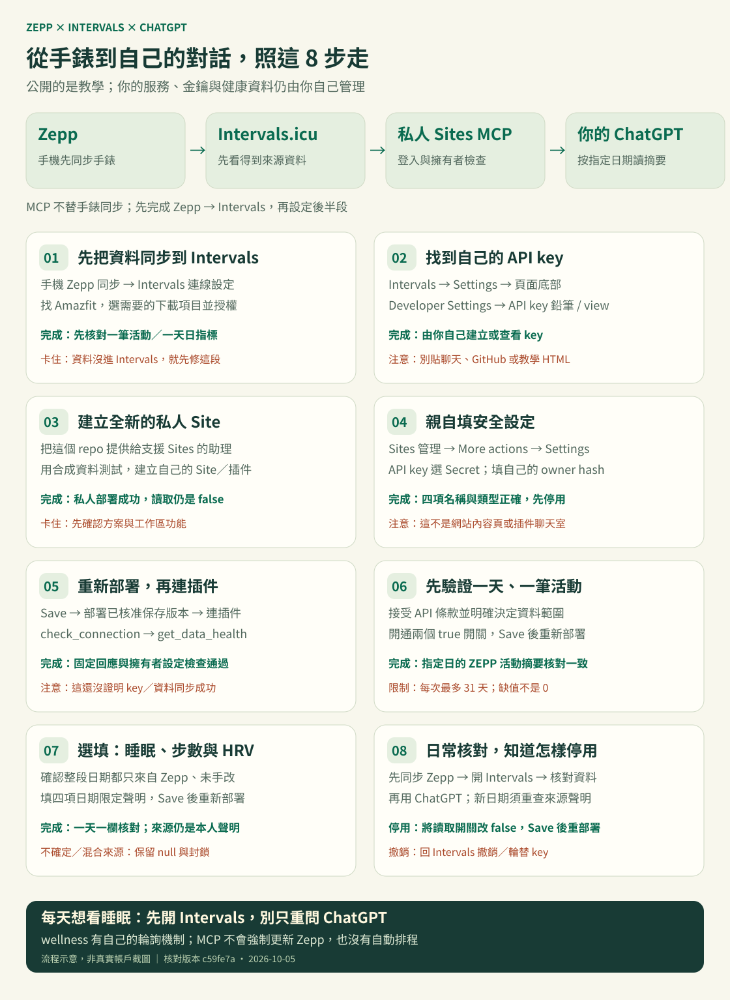
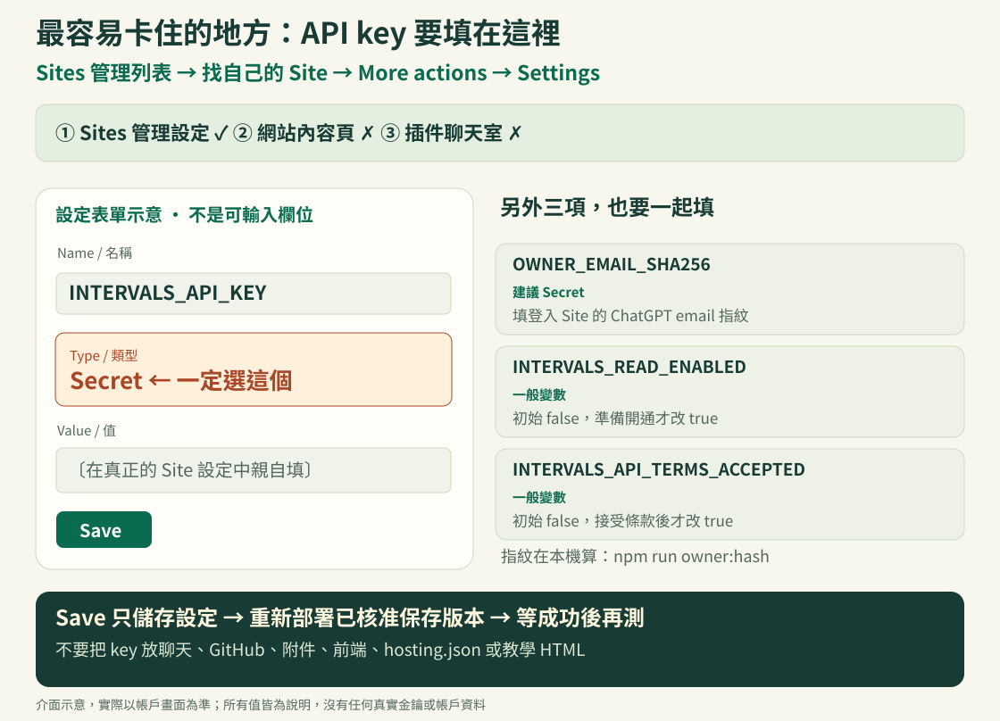

# 自己建立 Zepp × Intervals × ChatGPT MCP

這份教學帶你建立**自己的私人唯讀連接**：先讓 Zepp / Amazfit 資料進入你自己的 Intervals.icu，再用自己部署的 MCP，讓 ChatGPT 按你的要求讀取有限欄位。

這個 GitHub repo 可以公開；你建立的健康資料服務應保持私人。範本沒有 API key、帳戶識別資料、真正的健康紀錄或可沿用的 Site 身分。下載後預設無法讀取健康資料。

## 圖解快速開始

先看這張圖，知道每一步要去哪裡、做什麼、怎樣才算完成：



### 最容易卡住的設定位置

請進入 [Sites 管理列表](https://chatgpt.com/sites)，找到**自己的 Site → More actions → Settings**。API key 要選 **Secret**；按 Save 後，還要重新部署已核准的保存版本。



這兩張圖都是操作示意，不是私人帳戶截圖。實際介面以你的帳戶及官方文件為準。

### 可展開的完整 HTML 圖解

[查看／下載單檔互動 HTML](docs/visual-guide.html) · [直接下載原始 HTML](https://github.com/yung13yubabie/zepp-intervals-mcp/raw/refs/heads/main/docs/visual-guide.html)

GitHub 的 README 不會執行 HTML 裡的互動程式，所以圖解已直接嵌在本頁；完整 HTML 請下載後用瀏覽器開啟。若上方連結顯示原始碼，可在檔案頁使用 **Download raw file**，保留 `.html` 副檔名。

HTML 內含 8 個可展開步驟、介面示意、設定對照、成功／失敗判斷、常見問題，以及手機和列印版面。可離線閱讀，沒有外部資源、追蹤器、API 請求或金鑰輸入欄位。勾選進度預設不保存；只有你主動選擇後才存在目前瀏覽器，且不代表實際連線已成功。

<details>
<summary>圖片讀不到？展開八步純文字版</summary>

1. **Zepp → Intervals：** 先在手機 Zepp 同步，再到 Intervals 連線設定找 Amazfit；核對一筆活動及需要的日指標
2. **找到 API key：** Intervals Settings 底部的 Developer Settings，點 API key 鉛筆／view；不要把 key 貼到聊天或 GitHub
3. **建立自己的私人 Site：** 提供這份 repo，先用合成資料測試，建立新的私人 Sites MCP 與插件；讀取開關先保持 false
4. **填安全設定：** Sites 管理 → 自己的 Site → More actions → Settings；`INTERVALS_API_KEY` 必須選 Secret。用登入 Site 的 ChatGPT email 在本機執行 `npm run owner:hash`，填自己的 `OWNER_EMAIL_SHA256`
5. **儲存並重新部署：** Save → 重新部署已核准保存版本 → 接插件；先用 `check_connection` 和 `get_data_health`，這兩個工具都不讀健康資料
6. **先讀一天一筆：** 自己接受 API 條款、明確決定資料範圍後，將 `INTERVALS_API_TERMS_ACCEPTED` 與 `INTERVALS_READ_ENABLED` 改 true，重新部署；核對最多一筆明確標記 ZEPP 的活動摘要
7. **日指標另外開通：** 只有確認整段日期的步數、睡眠、靜息心率與 HRV 只來自 Zepp 且未手動改值，才填四項日期限定聲明並重新部署；不確定就保持封鎖
8. **日常與停用：** 先同步 Zepp → 自己開 Intervals 核對 → 再問 ChatGPT；停用時設 `INTERVALS_READ_ENABLED=false` 並重新部署，撤銷存取則回 Intervals 撤銷／輪替 key

</details>

**每天看睡眠前，先自己開啟 Intervals。** 官方說明 wellness 會在當日首次造訪後輪詢，之後一天內再輪詢數次；單純問 ChatGPT 不會強制刷新 Zepp。本 MCP 沒有自動排程，抓取時間也不是來源最新同步時間。[官方同步說明](https://forum.intervals.icu/t/amazfit-zepp-support-available/107652)

平台功能、方案額度與費用以你的帳戶及目前服務規定為準，不保證人人可用或免費。Sites 條款禁止處理 HIPAA 定義的受保護健康資訊（PHI）；個人運動資料是否屬於 PHI 要看情境，私人部署不等於合規保證。[Sites 條款 §3.3](https://openai.com/policies/chatgpt-sites-terms/)

## 先看懂資料怎麼走

```text
你的手錶 → Zepp → 你自己的 Intervals.icu
                         ↑ 固定 HTTPS GET
                    你的私人 Sites MCP
                         ↑ 登入、擁有者檢查、明確日期
                       你的 ChatGPT
```

這個 repo 實作最後兩段，**不負責把手錶資料同步進 Intervals**。ZeppBridge 是前期研究的另一條路線，並不是本流程必要的中繼站；原始專案、版本差異與服務選擇請看 [來源與製作脈絡](docs/UPSTREAM.md)。

## 從哪裡開始

1. [從零設定](docs/FROM_ZERO.md)：Zepp / Intervals、取得自己的 API key、建立私人 Site、連上 ChatGPT
2. [環境設定與擁有者](docs/SETTINGS.md)：Secret 類型、自己的 owner hash、開關與重新部署
3. [測試與常見問題](docs/TROUBLESHOOTING.md)：連線成功為何還讀不到資料、日期與來源限制
4. [安全、資料範圍與撤銷](SECURITY.md)
5. [備份與復原](docs/RESTORE.md)
6. [第三方來源與授權](THIRD_PARTY_NOTICES.md)
7. [本版檢查紀錄](docs/VALIDATION.md)

## 這一版可以做什麼

| MCP 工具 | 功能 |
| --- | --- |
| `check_connection` | 固定連線回應，不讀提供商或健康資料 |
| `get_data_health` | 擁有者限定的設定檢查，不驗證上游連線或同步新鮮度 |
| `list_workouts` | 只回傳 Intervals 標記 `source=ZEPP` 的活動摘要 |
| `get_workout_detail` | 指定日期範圍內的單筆摘要，不是完整運動檔案 |
| `get_metric_series` | 步數、靜息心率、RMSSD HRV、睡眠摘要；需要日期限定的來源聲明 |
| `get_sleep_detail` | 指定日的睡眠時數、分數、品質；沒有睡眠分期或起訖時間 |

每次日期範圍最多 31 天。無資料是 `null`，不是 0。沒有 GPS、路線、全天心率、訓練負荷、睡眠階段、名字、備註或原始檔案。抓取時間不代表最新 Zepp 同步時間，也不保證手錶所有資料都能取得。

## 開發者快速檢查

需要 Node.js 22.13 以上；建議使用目前仍受支援的 Node.js 22 LTS。所有測試只使用合成資料，執行下列指令不需要金鑰。

```sh
git clone https://github.com/yung13yubabie/zepp-intervals-mcp.git
cd zepp-intervals-mcp
npm ci
npm run verify
```

`verify` 執行合成測試、TypeScript、ESLint、公開內容掃描與正式建置。`npm run dev` 只作本機預覽；**不要將本機開發伺服器公開到網際網路，也不要在其中放真實金鑰**。正式身份驗證依賴 Sites 可信任的登入閘道，不能把同名 HTTP header 當作任意主機上的登入證明。

`.openai/hosting.json` 的 `YOUR_NEW_SITE_PROJECT_ID` 是刻意保留的佔位符。這讓本機檢查可運作，但不能直接部署到既有服務。依教學建立你自己的 Site，並由 Sites 登錄流程寫入新的識別值。

## 重要邊界

- 本程式只實作 GET；個人 API key 本身仍可能具有寫入權限
- 真實金鑰只由你親自填入 Sites 的 Secret，不放聊天、GitHub、附件、截圖或前端
- 接上插件不代表同意把任何健康資料送入對話；先決定允許的日期、欄位與用途
- 日指標 API 沒有來源欄位；你的 Zepp-only 聲明不是 API 證明
- 不把 Strava 來源資料交給 LLM；活動只保留明確標記 ZEPP 的資料，混合來源日指標保持封鎖
- 本 repo 公開不會替你建立帳戶、同意條款、提供金鑰或部署服務

這是個人使用教學與可檢查的實作範例，不是 Zepp、Intervals.icu 或 OpenAI 官方產品，也不是醫療建議。第三方條款與介面可能改變，操作前請核對 [來源頁](docs/UPSTREAM.md)。
